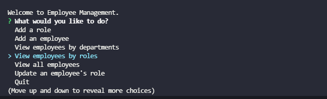

<h1 align="center">Employee Management Tracker</h1>

<!-- TABLE OF CONTENTS -->
<details open="open">
  <summary>Table of Contents</summary>
  <ol>
    <li>
      <a href="#about-the-project">About The Project</a>
      <ul>
        <li><a href="#user-story">User Story</a></li>
      </ul>
       <ul>
        <li><a href="#built-with">Built With</a></li>
      </ul>
    </li>
    <li>
      <a href="#links">Links</a>
    <li><a href="#screenshot">Screenshots</a></li>
  </ol>
</details>

## About The Project

Developers frequently have to create interfaces that allow non-developers to easily view and interact with information stored in databases. These interfaces are called **content management systems (CMS)**. This application is a CL application that manages a company's employee database using Node.js, Inquirer, and MYSQL.

## User Story

```md
AS A business owner
I WANT to be able to view and manage the departments, roles, and employees in my company
SO THAT I can organize and plan my business
```

## Built With

- [Javascript](https://www.javascript.com/)
- [Node](https://nodejs.org/en/)
- [Express](https://expressjs.com/)
- [MySQL](https://www.mysql.com/)

## Links

- [Video of CL App](https://youtu.be/GNhkSsG1nLs)
- [Github Repo](https://github.com/KimShiHyun/Employee-Management-System)

## Screenshot

The following image shows the web application's appearance and functionality:


